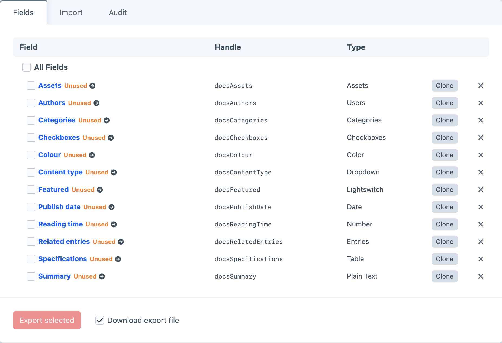
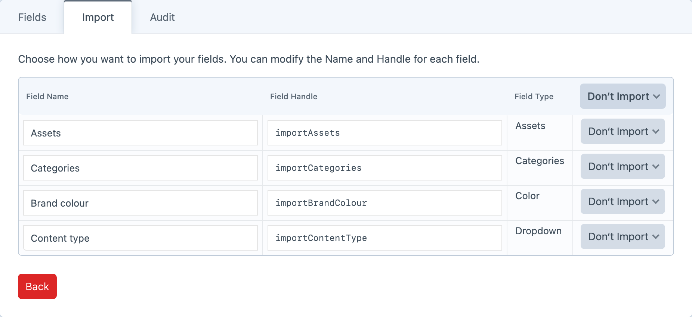

<!-- feature-intro -->
Make a large collection of Craft fields easier to manage. Clone individual fields or whole groups, find unused fields, and move field definitions between projects with importable JSON.
<!-- feature-intro-end -->

<!-- feature-section media-size="large" -->
## Clone fields and field groups

Replicating a carefully configured field can be tedious — just think of a sizeable Matrix field. Clone one field or an entire group, then change the name, handle and any settings that need to be different.

<!-- feature-section-end -->

<!-- feature-section media-size="medium" -->
## Clean up unused fields

Large sites and rapid prototypes tend to collect fields, and not all of them keep earning their place. Work with several definitions at once, see which are no longer attached to an element layout, then export selected fields or groups to reviewable JSON when a proven setup belongs in another project.

<!-- feature-section-end -->
